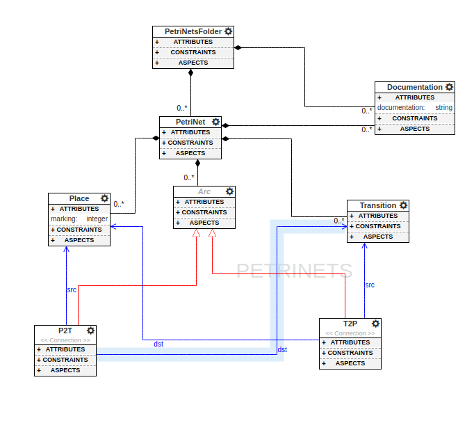
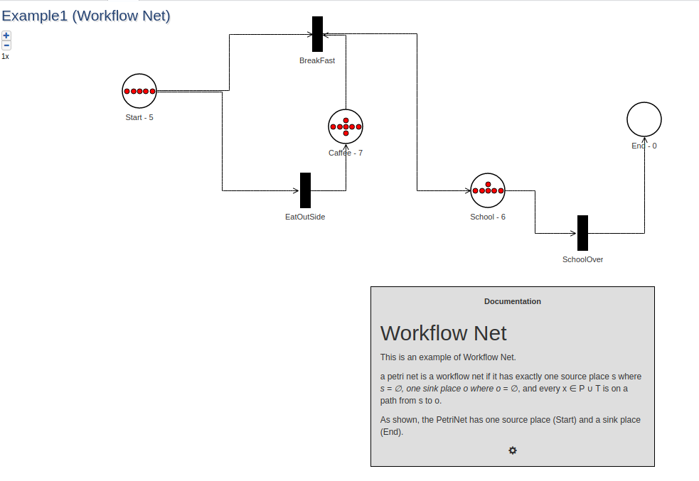
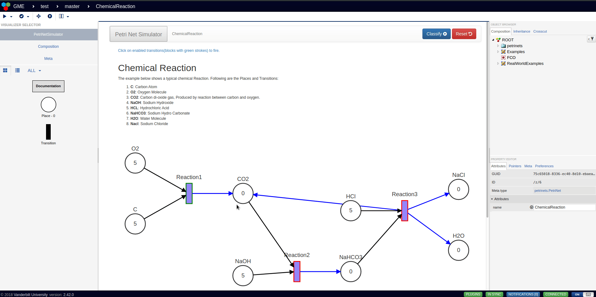

# PeNDeS
[](https://github.com/marketplace/actions/super-linter)

## About
**Petri Net Design Studio** (**P**en**D**e**S**) is a design studio built on top of [`webgme`](https://github.com/webgme/webgme) for the Petri nets Domain.
### Petri Nets
Petri nets are directed bi-partite graphs commonly used for modeling distributed systems. A petrinet has two types of
 elements **Place** (Usually depicted using a circle) and **Transition** (Usually depicted using a rectangle
 ). Additionally, a **Place** has a special attribute called `marking` (integer value). Places are connected with
  each other using transitions. An incoming Arc(Place2Transition) connects a Place to a Transition and the Place is
   called an inplace of the transition. While an outgoing Arc(Transition2Place) connects a Transition to a Place and
    the place is called outplace of the transition. A Transition is enabled if every inplace for a transition has
     `marking > 0`. An enabled transition can be fired and firing an enabled transition decreases the marking of its inplaces by 1 while
    increasing the markings of outplaces by 1.
  

## Installation
[`nodejs`](https://nodejs.org/en/) and [`mongodb`](https://www.mongodb.com/) are required. After installing `node` and
 `mongo`, you can use the following commands to use this design studio:
 ```shell script
$ git clone https://github.com/umesh-timalsina/PeNDeS
$ cd PeNDeS
$ npm install
$ npm start
```

Finally, navigate to http://localhost:8888 for the design studio:

## Developers
The [`JointJSDashboard`](./src/visualizers/widgets/PetriNetSimulator/JointJSDashboard) is a [`svelte`](https://svelte.dev/) component. While debugging the `PetriNetSimulator` visualizer, it is recommended to run the `watch-svelte` `npm` script for tracking changes in the `svelte` component. To do a debug start, follow the installtion
 instruction and in a separate terminal run `npm run watch-svelte`. 

## Components
The design studio has the following components:

### Metamodel
Figure below shows the metamodel. As shown, a `PetriNet` can have `Place`, `Transition` and `Arc` (either `P2T` or
 `T2P`).
 
 
 
### Seeds
Following seeds are provided by default:
1. [petrinets](./src/seeds/petrinets/petrinets.webgmex) : The library seed for defining the `petrinets` domain.
2. [project](./src/seeds/project/project.webgmex) : Uses the `petrinets` seed as a library and is the base seed for new
 projects for this studio.
3. [test](./src/seeds/test/test.webgmex) : Provides various example `PetriNets` and is used for testing.

### Decorator
A custom [decorator](./src/decorators/PetriNetsDecorator) decorates the composition view, for `Transition`, `Place
`, `PetriNet` and `PetriNetsFolder` nodes as shown in the figure below. The documentation node is decorated using
 `DocumentDecorator`.
 
 
### Plugin
The plugin [`ClassifyPetriNet`](./src/plugins/ClassifyPetriNet) is enabled by default in the `PetriNet` meta-node
, which determines whether the `PetriNet` is a `Marked Graph`, `Free Choice Petrinet`, `State Machine` or `Workflow Net
`. This plugin is called from the simulator as well.

### Simulator
The simulation for a Petri net is provided using [`PetriNetSimulator`](./src/visualizers/widgets/PetriNetSimulator) visualizer. The visualizer uses [`joint`](https://github.com/clientIO/joint), togehter with [`dagre`](https://github.com/dagrejs/dagre) and
 [`graphlib`](https://github.com/dagrejs/graphlib) to autolayout the Petrinet graph
 for a `PetriNet` node from the metamodel, which can then be used to fire all the enabled transitions. An example
  animation is shown below.


## Known Issues
1. For Decorator issues see [#17](https://github.com/umesh-timalsina/issues/17).

